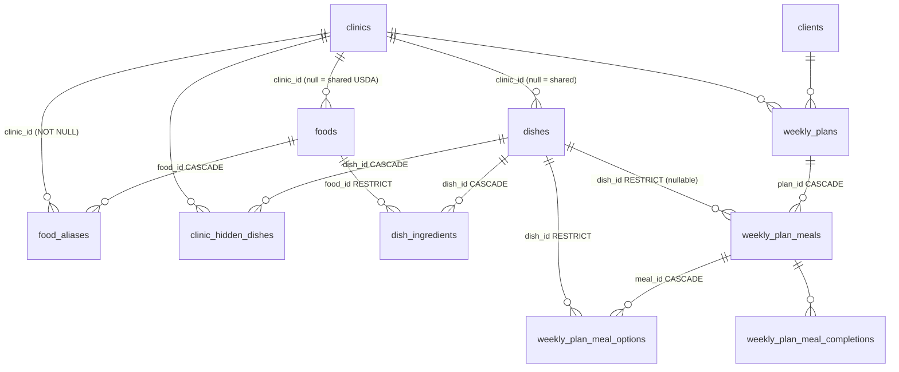
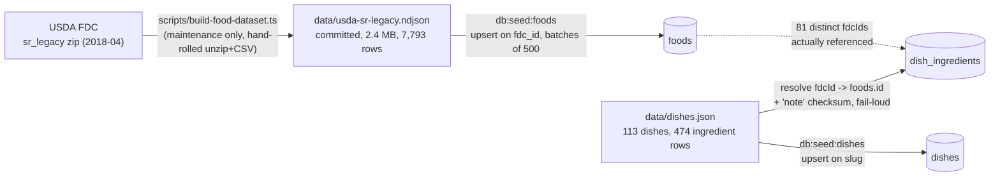
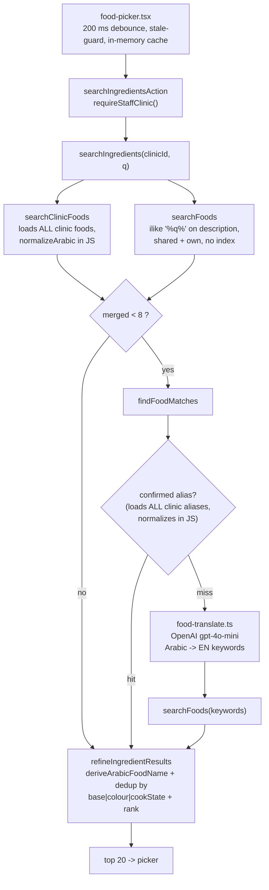
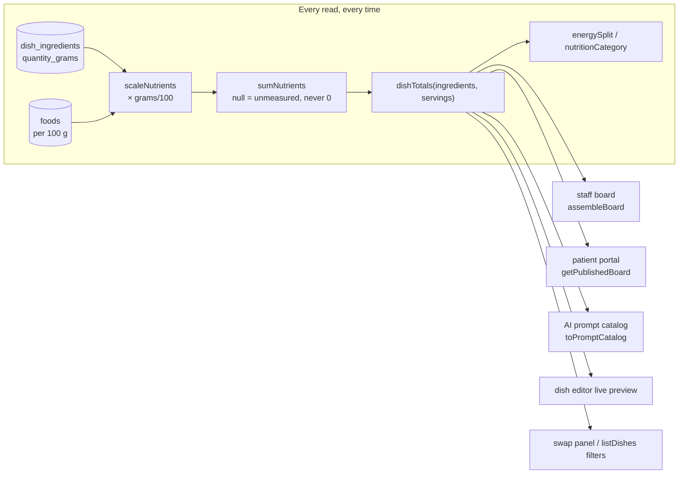
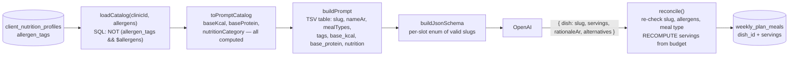
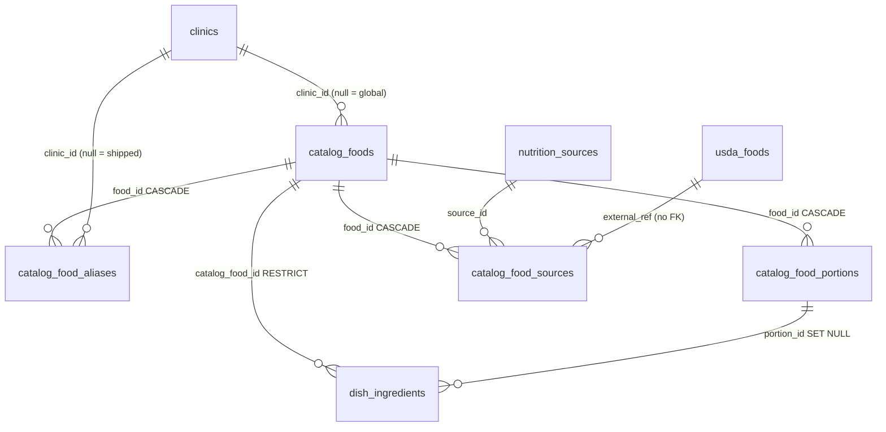
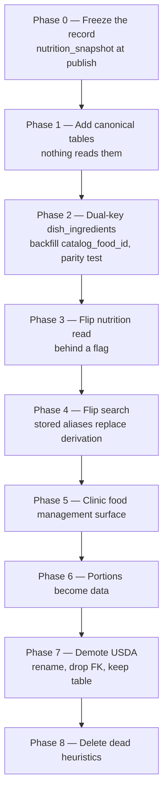

# Food data architecture — repository audit and migration architecture

Date: 2026-08-17
Branch: `study/ai-weekly-planner`
Status: **Analysis only.** No schema change, no data migration, no dataset
generation, no implementation. USDA infrastructure left in place.

---

## 0. Executive summary

The audit confirms the problem statement, and narrows it in one important way.

**USDA is the food catalog.** `foods` holds 7,793 SR Legacy rows across 25 US
food groups — 954 beef rows, 312 fast foods, 109 restaurant foods, 345 baby
foods, 186 rows matching alcohol terms. It has no Arabic name column populated
for any shared row (`name_ar` is null on all of them). Arabic reaches the
dietitian through a **runtime derivation heuristic**, not stored data.

**That heuristic demonstrably mislabels foods.** Running the repository's own
`deriveArabicFoodName()` over the committed dataset:

| Input (real USDA description) | Label shown to the dietitian | Correct? |
|---|---|---|
| `Eggplant, raw` | **بيض نيء** ("raw egg") | ✗ |
| `Eggplant, cooked, boiled, drained, without salt` | **بيض مطبوخ** ("cooked egg") | ✗ |
| `Candies, milk chocolate` | **حليب** ("milk") | ✗ |
| `Soup, cream of chicken, canned` | **دجاج معلب** ("canned chicken") | ✗ |
| `Restaurant, Chinese, egg rolls, assorted` | **بيض** ("egg") | ✗ |

The eggplant case is not hypothetical: `FOOD_BASES` is scanned in array order and
`{ match: ['egg'] }` (line 67) precedes `{ match: ['eggplant'] }` (line 89), and
`"eggplant".includes("egg")` is true. Eggplant (fdcId `169228`) **is used in the
shipped dish catalog**. 94 USDA rows currently resolve to بيض.

**And it over-collapses.** The dedup key is `base|colour|cookState`, so 1,176
distinct beef rows collapse onto لحم بقري, 449 onto زيت, 323 onto دجاج. A
dietitian searching لحم is shown one arbitrary representative of 1,176 cuts.

**The good news — the migration surface is far smaller than the table.** Only
**two** foreign keys in the entire schema reference `foods`, and the 113-dish
catalog is built from only **81 distinct USDA foods**. The canonical catalog does
not need to replace 7,793 rows; it needs to replace 81, plus whatever clinics have
created.

**The one blocking hazard is not the catalog — it is the plan record.** A weekly
plan stores `dish_id + servings` and **no nutrition**. Every calorie on the staff
board and in the patient portal is recomputed live from `foods` at read time.
`publishPlan` flips a status column and freezes nothing. Therefore **any change to
a food's nutrition silently rewrites already-published and archived patient plans**
— which is exactly what a catalog migration does, at scale, in one transaction.
This is already known and spec'd (`2026-08-16-plan-nutrition-snapshots-design.md`)
but **not built**, and it must land before any remapping.

---

## 1. Current architecture

### 1.1 Table map

### 1.2 The two tables that matter

**`foods`** — one table, two populations, no discriminator column other than
`clinic_id`:

| Population | `clinic_id` | `fdc_id` | `name_ar` | `category` | Count |
|---|---|---|---|---|---|
| Shared USDA SR Legacy | `NULL` | set, unique | **always null** | one of 25 USDA groups | 7,793 |
| Clinic custom food | set | `NULL` | set | literal `'Clinic custom'` | per-tenant |

Columns: 12 nutrients **per 100 g** (`kcal`/`protein`/`fat`/`carbs` NOT NULL; the
other 8 nullable, where null means *never measured* and is deliberately not
summed), plus exactly **one** household measure (`portion_grams` +
`portion_label`). 7,533 of 7,793 shared rows have a portion.

**`dishes` + `dish_ingredients`** — a dish carries **no nutrition of its own**.
Its composition is `dish_ingredients` rows pointing at `foods`, and every number
displayed anywhere is derived at read time.

### 1.3 Complete list of foreign keys referencing `foods`

Verified against `drizzle/meta/0026_snapshot.json` (current head).

| # | From | Column | On delete | Purpose |
|---|---|---|---|---|
| 1 | `dish_ingredients` | `food_id` **NOT NULL** | `RESTRICT` | The only nutrition path in the product |
| 2 | `food_aliases` | `food_id` NOT NULL | `CASCADE` | Clinic's remembered Arabic → food mapping |

Historical, **already gone**: `meal_plan_items.food_id` (`drizzle/0007`,
`RESTRICT`) — meal plans V1, table dropped.

For completeness, the four FKs referencing `dishes` (they constrain the migration
because dish identity is the AI's contract):

| From | Column | On delete |
|---|---|---|
| `dish_ingredients` | `dish_id` | `CASCADE` |
| `clinic_hidden_dishes` | `dish_id` | `CASCADE` |
| `weekly_plan_meals` | `dish_id` (**nullable**) | `RESTRICT` |
| `weekly_plan_meal_options` | `dish_id` | `RESTRICT` |

**Conclusion: two FKs, one of which is load-bearing.** Everything else is
downstream of `dish_ingredients`.

---

## 2. Current data flow

### 2.1 Seed / import pipeline

Both seeds are idempotent by natural key (`fdc_id`, `slug`) so a re-seed updates
in place and never orphans a plan. `seed-dishes.ts` resolves every `fdcId` up
front and aborts the **whole** seed if any id is unknown or if the JSON `note` no
longer prefixes the USDA description — a deliberate checksum against a food
silently moving underneath a recipe.

**Defect found:** `seed-dishes.ts` deletes and re-inserts `dish_ingredients`
wholesale, writing only `dishId`, `foodId`, `quantityGrams`, `sortOrder`. It
therefore **wipes `display_name_ar`, `household_label`, and `household_grams`** on
every re-seed of a shared dish. Today that is nearly harmless (shared dishes carry
no units yet); under the target schema it would destroy portion links.

### 2.2 Ingredient search (the user-facing surface being replaced)

Three things this diagram makes plain, and all three are the complaint:

1. The **Arabic label is manufactured at request time** from an English string
   (`refineIngredientResults` → `deriveArabicFoodName`), never read from storage.
2. The **AI translator sits inside a keystroke path** (gated behind a threshold of
   8 local hits, but still on the critical path for any Arabic term the library is
   thin on).
3. **Dedup is a display concern.** The 1,176 beef rows still exist; one is picked
   as representative by `pickRepresentative()` and the rest are counted into
   `variantCount` for a "show N more" affordance.

### 2.3 Nutrition calculation — and why published plans drift

`nutrition.ts` is pure, well-tested, and correct. The problem is **where** it runs:
on every read, against **current** `foods` rows.

Confirmed by inspection:

- `publishPlan` (`mutations.ts:382`) sets `status`, `publishedAt`, `updatedAt`.
  **Nothing else.**
- `getPublishedBoard` → `assembleBoard` → `loadDishesByIds` → `dishTotals`.
- There is no `nutrition_snapshot` column anywhere in the current schema.

**Answer to "can existing/published plans change when food nutrition changes":
yes, unconditionally, including archived plans that are supposed to be the record
of what was prescribed.** Note this is already reachable today without any
migration — `updateClinicDish` and `createCustomFood` let a clinic edit recipes and
custom-food numbers.

### 2.4 AI meal planner

**This part is already correct and needs the least work.** The model never sees a
food, never sees an id, and cannot state a nutrition number — the JSON schema only
admits a dish slug and a multiplier, and `reconcile()` discards even the model's
`servings` in favour of arithmetic against the slot budget. `prompt.test.ts`
asserts no name/email/phone/id appears in the payload.

Requirement 12 ("AI should reference food IDs and must not invent nutrition
values") is therefore **already satisfied one level up**, at the dish. The target
architecture should preserve this shape rather than lower the AI to food level.

---

## 3. Relevant files

### 3.1 Schema

| File | What it defines |
|---|---|
| `src/db/schema/foods.ts` | `foods` (7,793 USDA + clinic customs, per-100 g, one portion), `food_aliases` |
| `src/db/schema/dishes.ts` | `dishes`, `dish_ingredients`, `clinic_hidden_dishes` |
| `src/db/schema/weekly-plans.ts` | `weekly_plans`, `weekly_plan_meals`, `weekly_plan_meal_options`, `weekly_plan_generations` |
| `src/db/schema/index.ts` | Barrel re-export |
| `drizzle/0007…`, `0009…`, `0025…`, `0026…` | foods created; dish FK; clinic_id + name_ar added |

### 3.2 Seed / data

| File | Role |
|---|---|
| `scripts/build-food-dataset.ts` | USDA zip → NDJSON. Maintenance only, runs "a few times a decade" |
| `scripts/seed-foods.ts` | NDJSON → `foods`, upsert on `fdc_id` |
| `scripts/seed-dishes.ts` | `dishes.json` → `dishes` + `dish_ingredients`; fail-loud fdcId/note validation; **wipes per-ingredient extras** |
| `data/usda-sr-legacy.ndjson` | 7,793 foods, committed, public domain |
| `data/dishes.json` | 113 dishes, 474 ingredient rows, 81 distinct foods |

### 3.3 Arabic / search / display (the layer the target schema replaces)

| File | Role | Fate under target |
|---|---|---|
| `arabic-normalize.ts` | Conservative fold (alef forms, tashkeel, tatweel). Documents the deferred DB-level unique constraint | **Keep** — still needed for alias matching |
| `arabic-food-terms.ts` | 48 `FOOD_BASES`, `PREP_MODIFIERS`, `NOISE_SEGMENTS`, `COOK_STATE`, `groupKey` derivation | **Delete** — becomes stored aliases + `state` column |
| `ingredient-refine.ts` | Annotate / collapse variants / rank | **Mostly delete** — ranking survives, collapsing does not |
| `food-display.ts` | `conciseFoodName`, `getFoodDisplayName`, `getFoodSecondaryName` | **Simplify** — names become stored fields |
| `food-translate.ts` | OpenAI Arabic→EN keyword translator | **Delete from the hot path**; optionally retain as an authoring tool |
| `food-matching.ts` | Alias lookup → translator → search | **Rewrite** — alias table becomes primary, not fallback |
| `ingredient-search.ts` | Merges clinic → shared → translated | **Simplify** to one canonical source |

### 3.4 Nutrition / catalog / plan

| File | Role |
|---|---|
| `nutrition.ts` | `NUTRIENT_KEYS`, `scaleNutrients`, `sumNutrients`, `combineTotals`, `energySplit`, `dishTotals`, `dishGrams`, `baseServingKcal`, `nutritionCategory`. Pure. **Unchanged by the migration** |
| `ingredient-units.ts` | Derives a unit menu from one USDA `portion_label` string; `GRAMS_ONLY_CATEGORIES` keys off USDA category names; fractions are arithmetic |
| `queries.ts` (1,500+ lines) | `loadCatalog`, `loadDishesByIds`, `toPromptCatalog`, `listCatalogForBoard`, `listDishes`, `getDishDetailForClinic`, `searchFoods`, `searchFoodsById`, `listClinicFoods`, `searchClinicFoods`, `assembleBoard`, `getBoard`, `getPublishedBoard`, swap candidates |
| `catalog-mutations.ts` | `createClinicDish`, `updateClinicDish`, `deleteClinicDish`, `hide/unhideSharedDish`, `rememberFoodAlias`, `createCustomFood` (3-path reuse guard) |
| `catalog-schema.ts` | Zod for clinic dish + custom food; `CUSTOM_FOOD_UNITS` |
| `catalog-actions.ts` | Server actions; every write re-resolves clinic from session |
| `mutations.ts` | Plan writes incl. `publishPlan` (status only) |
| `prompt.ts` / `generate.ts` / `schema.ts` / `llm.ts` | Prompt build, JSON schema, reconciliation |

### 3.5 UI

`components/food-picker.tsx` (unified search), `custom-food-dialog.tsx`,
`dish-editor.tsx`, `dish-list.tsx`, `dish-details.tsx`, `dish-filters.tsx`,
`dish-catalog.tsx`, `meal-detail-panel.tsx`, `portal-meal-card.tsx`.

**Gap confirmed (requirement 9):** `listClinicFoods()` exists in `queries.ts` and
**has no caller** — no route, no component. There is no clinic food management
surface. Custom foods can only be created inline from the dish editor's picker,
and can never afterwards be listed, edited, or deleted.

### 3.6 Tests

97 test files repo-wide. Directly in scope:

| Area | Files |
|---|---|
| Nutrition arithmetic | `nutrition.test.ts` |
| Arabic | `arabic-normalize.test.ts`, `arabic-food-terms.test.ts`, `arabic-catalog-search.test.ts` |
| Search / refine | `ingredient-search.test.ts`, `ingredient-refine.test.ts`, `food-matching.test.ts`, `food-translate.test.ts`, `food-display.test.ts` |
| Units | `ingredient-units.test.ts`, `ingredient-units-household.test.ts` |
| Catalog CRUD + isolation | `catalog-mutations.test.ts`, `catalog-read.test.ts`, `catalog-schema.test.ts`, `catalog-filter.test.ts`, `catalog-ownership.test.ts`, `list-dishes.test.ts` |
| Queries + clinic scope | `queries.test.ts` (`loadCatalog ownership`, `searchFoods` cross-clinic, `clinic food library`) |
| Plans | `mutations.test.ts`, `editor-mutations.test.ts`, `editor-state.test.ts`, `week.test.ts`, `drift.test.ts`, `band.test.ts` |
| AI | `prompt.test.ts`, `generate.test.ts`, `similar.test.ts`, `targets.test.ts` |
| Seed | `seed-dishes-validation.test.ts` |

Clinic isolation is genuinely covered (`arabic-catalog-search.test.ts` §clinic
isolation; `queries.test.ts` cross-clinic cases). **No test asserts that a
published plan's nutrition is stable** — because it isn't.

⚠ Operational note carried from the handoff: the test DB is **not safe for
concurrent `bun test` runs** (FK errors on shared clinic teardown). Run suites
serially.

---

## 4. Migration risks

### Critical

**C1 — Remapping rewrites history in published and archived patient plans.**
Plans store `dish_id + servings` only; `assembleBoard` computes live; `publishPlan`
freezes nothing. Repointing `dish_ingredients` from a USDA row to a canonical row
changes the calories on plans a patient is currently following and on archived
plans that are the clinical record of what was prescribed. *Mitigation: implement
`nutrition_snapshot` (already spec'd) as Phase 0, before any remapping.*

**C2 — `dish_ingredients.food_id` is NOT NULL / `ON DELETE RESTRICT`.** It is the
single nutrition path in the product. A partial or mis-keyed backfill does not
error — it produces recipes that look fine and are wrong. Deleting a `foods` row
still in use hard-fails the transaction. *Mitigation: additive dual-key column,
never an in-place UPDATE of `food_id`; a completeness assertion before any flip.*

**C3 — Tenant leak through the shared `foods` table.** USDA rows and every
clinic's private custom foods live in the same table, distinguished only by
`clinic_id`. A migration that filters `clinic_id IS NULL` **orphans every clinic
custom food**; one that migrates everything **publishes one tenant's private food
into the global catalog**, violating requirement 10. *Mitigation: split the two
populations explicitly, and make promotion an insert of a new global row, never a
flip of `clinic_id`.*

### High

**H1 — `seed-dishes.ts` destroys per-ingredient data on every run.** It replaces
`dish_ingredients` wholesale writing only 4 columns, dropping
`display_name_ar`/`household_label`/`household_grams`. Under the target schema it
would drop portion links too. Must be fixed *before* the seed becomes the
migration vehicle.

**H2 — `food_aliases` has no room for a global alias.** `clinic_id` is NOT NULL
and the unique index is `(clinic_id, name_ar)`. Requirement 3 (stored regional
synonyms shipped with the catalog) needs nullable-tenant rows, and a plain unique
index does not constrain NULLs — needs partial unique indexes or a sentinel.

**H3 — Removing the Arabic derivation is a visible behaviour change.** 4,751 of
7,793 descriptions currently produce a derived label. Dietitians have been reading
those labels — including the wrong ones. Cutover must be deliberate and
communicated, not silent.

**H4 — `createCustomFood`'s reuse-by-description path can resolve a "custom food"
to a USDA row.** Path 3 matches `lower(btrim(description))` against shared rows.
So an id a clinic believes is theirs may be a global USDA id. Any remap must keep
those ids resolving.

**H5 — Dish `slug` is the AI's contract and is globally unique.** It feeds the
JSON-schema `enum`, `previousPlanSlugs`, and regeneration. A catalog reshuffle
that renames slugs breaks generation for existing clients. *Slugs must not change
during a food migration.*

**H6 — App-level check-then-insert race on food/alias creation.** Documented in
`arabic-normalize.ts`; the DB-level normalized-unique constraint is deliberately
deferred. A migration that bulk-inserts canonical foods and aliases concurrently
with live traffic can duplicate.

### Medium

**M1 — Unit menus degrade silently to grams-only.** `deriveUnitOptions` returns
`[GRAMS_UNIT]` whenever it cannot parse a portion label. Canonical foods that ship
without portions lose every household unit with no error.

**M2 — `GRAMS_ONLY_CATEGORIES` is keyed on USDA's 25 category strings.** A new
MENA taxonomy silently disables the meat/fish grams-only product rule.

**M3 — `resolveSavedRow` falls back to grams when a saved `household_label` no
longer matches the food's menu.** Correct (never rescales the recipe), but after
migration many saved rows will quietly display in grams instead of their unit.

**M4 — Search implementation assumptions.** `searchFoods` uses unindexed
`ilike '%…%'` (justified in a comment by "7,793 rows is a few milliseconds");
`searchClinicFoods` and `findFoodMatches` load whole tables and normalize in JS. A
~300-row canonical catalog makes this trivially fine, but a **global** alias table
needs a real index.

**M5 — `foods_fdc_id_idx` is UNIQUE on a nullable column.** Works today (Postgres
permits multiple NULLs, which is how clinic customs coexist), but is fragile.

**M6 — Test DB cannot run suites concurrently.** Migration verification must be
serialized.

**M7 — `nutritionCategory` and the "high protein" filter are computed from
recipes.** Changing food values changes dish labels and therefore which dishes the
filter returns and what the AI is told. Expected, but must be diffed, not
discovered.

### Low

**L1** — `data/dishes.json`'s `note` checksum ties dish authoring to USDA
descriptions; needs replacing with canonical slugs.
**L2** — ~200 lines of heuristics (`FOOD_BASES`, `PREP_MODIFIERS`,
`NOISE_SEGMENTS`, `COOK_STATE`, `COOK_PRIORITY`) become dead code.
**L3** — i18n keys for "show English" / "show N other variants" become meaningless.
**L4** — `foods.category` currently drives only the unit menu; its 25 values are
otherwise unused.
**L5** — `conciseFoodName` / `getFoodSecondaryName` become near-trivial.

---

## 5. Recommended target schema

Design principles: **additive first** (new tables beside the old ones, so every
phase is reversible), **names and aliases are data**, **state is explicit**,
**provenance is recorded**, and **`nutrition.ts` does not change** — the per-100 g
basis and the null-means-unmeasured rule are already right.

### `catalog_foods` — the canonical food

| Column | Type | Notes |
|---|---|---|
| `id` | uuid PK | |
| `clinic_id` | uuid NULL → clinics CASCADE | **null = global canonical; set = clinic-private** (req. 9, 10) |
| `slug` | text NOT NULL | stable natural key, e.g. `lentils-red-dry`. Makes the seed an upsert |
| `name_ar` | text **NOT NULL** | first-class stored name (req. 2) |
| `name_en` | text **NOT NULL** | first-class stored name (req. 2) |
| `category` | text NOT NULL | canonical MENA taxonomy, **not** USDA's 25 groups |
| `state` | text NOT NULL | `raw`\|`cooked`\|`dry`\|`canned`\|`fried`\|`grilled`\|`baked`\|`frozen`\|`prepared` (req. 4) |
| `preparation_note_ar` / `_en` | text NULL | e.g. "مسلوق بدون ملح" |
| `kcal, protein, fat, carbs` | real NOT NULL | **per 100 g** (req. 5) |
| `fiber, sugar, saturated_fat, cholesterol, sodium, calcium, iron, potassium` | real NULL | null = never measured — preserves the existing `unmeasured` semantics |
| `verification_status` | text NOT NULL | `verified`\|`provisional`\|`estimated` |
| `verified_at` / `verified_by` | timestamptz / uuid NULL | |
| `promotion_status` | text NOT NULL default `'private'` | `private`\|`submitted`\|`promoted`\|`rejected` — enforces req. 10 |
| `is_active` | boolean NOT NULL default true | retire without breaking recipes |
| `created_at` / `updated_at` | timestamptz | |

Indexes: unique `(slug)` **where `clinic_id is null`**; unique
`(clinic_id, slug)` where not null; index `(clinic_id)`; index `(category)`.

> **Why nutrition stays inline rather than in a child table:** `dishTotals` /
> `scaleNutrients` already consume a flat per-100 g object. Keeping the columns
> inline means **`nutrition.ts` and every one of its 40+ tests are untouched by the
> migration.** Provenance goes in a sibling table instead of splitting the hot path.

### `catalog_food_aliases` — stored Arabic/regional synonyms (req. 3)

| Column | Type | Notes |
|---|---|---|
| `id` | uuid PK | |
| `food_id` | uuid NOT NULL → catalog_foods CASCADE | |
| `clinic_id` | uuid NULL → clinics CASCADE | **null = alias shipped with the catalog** (fixes H2) |
| `name` | text NOT NULL | as typed |
| `normalized_name` | text NOT NULL | `normalizeArabic(name)` stored, **not** computed per request |
| `locale` | text NOT NULL | `ar` \| `en` |
| `kind` | text NOT NULL | `synonym` \| `regional` \| `dialect` \| `misspelling` |
| `region` | text NULL | `PS` \| `JO` \| `LB` \| `SY` \| `EG` … |

Indexes: unique `(normalized_name)` **where `clinic_id is null`**; unique
`(clinic_id, normalized_name)` where not null; index `(food_id)`. Storing
`normalized_name` closes the race documented in `arabic-normalize.ts` (H6) **and**
lets the alias lookup be a real indexed query instead of a full-table scan in JS.

This table is what deletes `arabic-food-terms.ts`. أرز/رز, دجاج/جاج, لبن/زبادي,
بندورة/طماطم, بطاطا/بطاطس, كوسا/كوسى — the synonyms already listed in the handoff
as "suggested" — become rows.

### `catalog_food_portions` — household portions map back to grams (req. 6)

| Column | Type | Notes |
|---|---|---|
| `id` | uuid PK | |
| `food_id` | uuid NOT NULL → catalog_foods CASCADE | |
| `unit_key` | text NOT NULL | `loaf`\|`piece`\|`slice`\|`cup`\|`tbsp`\|`tsp`\|… |
| `label_ar` / `label_en` | text NOT NULL | "رغيف" / "loaf" |
| `grams` | real NOT NULL | **grams one unit weighs — the mapping back to grams** |
| `is_default` | boolean NOT NULL default false | replaces `defaultUnitKey` guessing |
| `sort_order` | integer NOT NULL default 0 | |

Unique `(food_id, unit_key)`. **Many portions per food**, replacing today's single
`portion_grams`/`portion_label` and the fraction arithmetic in `buildFamily()`.
Fixes M1/M2: the unit menu becomes a query, not a string parse plus a category
lookup.

### `nutrition_sources` + `catalog_food_sources` — provenance (req. 7, 8)

`nutrition_sources`: `id`, `key` (`usda_sr_legacy`, `lebanese_fct`, `manufacturer`,
`clinic_entered`, `estimated`), `name`, `version`, `url`, `licence`,
`is_reference_only` boolean.

`catalog_food_sources`: `id`, `food_id` → catalog_foods CASCADE, `source_id` →
nutrition_sources, `external_ref` text (the fdcId as text), `relation` text
(`derived_from` \| `validated_against` \| `conflicts`), `variance` jsonb NULL (per-
nutrient % delta vs our stored value), `checked_at` timestamptz.

Unique `(food_id, source_id, external_ref)`.

This is the table that **demotes USDA to a reference/validation source** (req. 8):
a canonical food links to its USDA origin as `derived_from`, and a periodic job can
write `validated_against` rows with a `variance` blob to produce a drift report —
without USDA ever being user-facing again.

> **On "every verified nutrition value has provenance":** recorded here at
> **food granularity**, which is the granularity real food-composition tables
> publish at. Per-*nutrient* provenance would require a long/EAV table and would
> pay a join on the hottest read path in the product. Recommended: food-level now,
> and if a genuine mixed-source food appears, add a nullable `nutrient_key` column
> to `catalog_food_sources` rather than restructuring.

### Changes to existing tables

**`dish_ingredients`** — additive:

| Column | Type | Notes |
|---|---|---|
| `catalog_food_id` | uuid **NULL** → catalog_foods RESTRICT | Nullable **during migration only**; NOT NULL at Phase 7 |
| `portion_id` | uuid NULL → catalog_food_portions SET NULL | The chosen household unit as a real reference |
| `portion_quantity` | real NULL | e.g. `2` (pieces) |
| `food_id` | *existing*, becomes nullable at Phase 7 | Kept until the flip is proven |

`quantity_grams` stays authoritative — it is what `dishTotals` consumes, and
keeping it means a portion definition changing later cannot silently rescale a
saved recipe.

**`weekly_plan_meals`** (from the existing snapshot spec — prerequisite, not new
work): `nutrition_snapshot jsonb NULL`. Null = compute live (drafts); non-null =
frozen `NutrientTotals` + total grams, written in `publishPlan`.

**`foods`** → renamed `usda_foods` at Phase 7. Reference/validation only, no FK
from `dish_ingredients`. **Not deleted.**

**`food_aliases`** → retained read-only through Phase 4, then migrated into
`catalog_food_aliases` and dropped at Phase 7.

### AI representation (req. 12)

**No change to the contract.** The model continues to emit dish slugs and a
serving multiplier, constrained by a per-slot JSON-schema `enum`, with
`reconcile()` re-validating server-side and recomputing servings. If food-level AI
is ever wanted, it emits `catalog_foods.slug` under the same pattern — an enum of
real slugs, resolved to a uuid server-side, with nutrition read from the row. The
model must never be given a nutrition field it can write.

---

## 6. Phased migration plan

Every phase ends with a working application. Phases 0–6 are **additive only** — no
column is dropped and no data is destroyed before Phase 7.

### Phase 0 — Freeze the clinical record *(blocking prerequisite)* ✅ IMPLEMENTED 2026-08-17

`nutrition_snapshot` jsonb on `weekly_plan_meals` (migration `0027_tense_gorgon`),
written in `publishPlan` inside its existing transaction, read through the single
`resolveMealNutrition` branch in `assembleBoard`, cleared atomically by
`unpublishPlan`, and backfilled by `scripts/backfill-plan-nutrition-snapshots.ts`.

The open product decision was resolved as **published plans are immutable**:
`editablePlan` now refuses anything but a draft, the in-place "edit published" mode
(`allowPublished`) is retired end to end, and the supported workflow is
unpublish → edit → republish. No snapshot is ever overwritten in place.

Known limit recorded here rather than in code: this preserves plan *identity*, not
a separate historical version. Unpublishing discards the previously frozen values.
Copy-on-write publishing — each publish minting an immutable version, editing
forking a new draft — would keep both and is out of scope.

*Why first:* without it, **every later phase is a silent rewrite of patient
history.* With it, remapping is invisible to published plans by construction.
**After this phase the app is unchanged from a user's point of view.**

### Phase 1 — Add canonical tables, read by nothing

Migration creating `catalog_foods`, `catalog_food_aliases`,
`catalog_food_portions`, `nutrition_sources`, `catalog_food_sources`. A seed script
`scripts/seed-catalog-foods.ts` and a `data/catalog-foods.json` containing an
initial set — **the 81 foods the existing dish catalog actually uses** — is the
natural first tranche, but generating that dataset is explicitly out of scope here.

Nothing in the application reads these tables. **Zero user-visible change; zero
risk.**

### Phase 2 — Dual-key `dish_ingredients`

Add nullable `catalog_food_id`, `portion_id`, `portion_quantity`. Add a persisted
mapping `usda_food_id → catalog_food_id` (a data table, not a script constant, so
the backfill is deterministic and re-runnable). Backfill `catalog_food_id`.

Fix H1 first: `seed-dishes.ts` must preserve per-ingredient columns.

**Nutrition still reads `foods`.** Add a parity check that, for every
`dish_ingredients` row with both keys set, `dishTotals` via the canonical row is
within an agreed tolerance of `dishTotals` via the USDA row — and surface the
outliers as a report. Divergence here is *expected* (that is the point of a
canonical catalog) but it must be reviewed, not discovered on a patient's screen.

### Phase 3 — Flip the nutrition read

`loadCatalog` / `loadDishesByIds` / `getDishDetailForClinic` read canonical
nutrition when `catalog_food_id` is set, USDA otherwise, behind a server-side flag.
Because Phase 0 froze published plans, this changes **drafts and the catalog
browser only**.

Guard: refuse to enable the flag while any active dish has an ingredient with a
null `catalog_food_id`.

### Phase 4 — Flip search onto the canonical catalog

`searchIngredients` reads `catalog_foods` + `catalog_food_aliases` (indexed on
`normalized_name`). The AI translator and USDA fallback move behind the same flag,
default off. `refineIngredientResults` loses variant collapsing (there are no
variants any more) and keeps ranking.

**This is the phase that delivers the product goal** — thousands of irrelevant
variants, restaurant/branded/alcohol rows, and the mislabelling heuristic all stop
being reachable from the picker in one flag flip. It is also the most visible
change, so it wants its own release note.

### Phase 5 — Clinic food management surface (req. 9, 10)

A real screen for clinic-owned foods: list, edit, deactivate, and *nominate for
promotion*. `listClinicFoods()` finally gets a caller. Promotion inserts a **new
global row** and links it; it never flips `clinic_id` (C3).

### Phase 6 — Portions become data (req. 6)

`ingredient-units.ts` reads `catalog_food_portions` instead of parsing
`portion_label`. Fractions become rows rather than arithmetic; `GRAMS_ONLY_CATEGORIES`
becomes "this food ships no non-gram portions" (M2). Fall back to the derived menu
for any ingredient still on a USDA row.

### Phase 7 — Demote USDA

Only when every active dish ingredient has a `catalog_food_id`: make
`dish_ingredients.food_id` nullable, drop its FK, rename `foods` → `usda_foods`,
migrate `food_aliases` into `catalog_food_aliases`, make
`dish_ingredients.catalog_food_id` NOT NULL.

`usda_foods` and the whole NDJSON/build pipeline **stay** as a reference and
validation source feeding `catalog_food_sources`.

### Phase 8 — Delete dead heuristics

`arabic-food-terms.ts`, most of `ingredient-refine.ts`, the hot-path use of
`food-translate.ts`, the unused branches of `food-display.ts`, and the now-unused
i18n keys.

---

## 7. Rollback strategy

**The design goal is that no phase before 7 needs a schema rollback.**

| Layer | Mechanism |
|---|---|
| **Schema** | Phases 1–6 are `CREATE TABLE` / `ADD COLUMN NULL` only. Rolling back = leaving the new objects unread. No `DROP`, no `ALTER … NOT NULL`, no type change |
| **Reads** | Every read flip (Phases 3, 4, 6) is behind a server-side flag. **Rollback is a flag flip, not a deploy and not a migration revert** |
| **Backfill** | The `usda_food_id → catalog_food_id` mapping is a persisted table. A bad mapping is corrected by `UPDATE dish_ingredients SET catalog_food_id = NULL` for the affected rows — the USDA `food_id` is still there and still authoritative until Phase 7 |
| **Published plans** | Immune from Phase 0 onward: frozen snapshots do not consult either food table |
| **Drafts** | Worst case a draft shows different numbers after a flip; the dietitian has not prescribed it. Recovering = flip the flag and reload |
| **Dish slugs** | Never change during the migration, so generation, `previousPlanSlugs`, and the JSON-schema enum are stable throughout (H5) |
| **Phase 7 (the only hard one)** | Gate behind an assertion that zero active `dish_ingredients` rows have a null `catalog_food_id`. Do the rename and the FK drop in one migration with a tested down-migration. Take a database snapshot immediately before |
| **Seeds** | `db:seed:foods` and `db:seed:dishes` remain runnable and idempotent throughout, so a corrupted `dish_ingredients` set can be rebuilt from `data/dishes.json` |

Explicit non-goal: rolling back *after* clinics have created foods in the canonical
tables. From Phase 5 onward, forward-fix only.

---

## 8. Tests required, per phase

Existing suites that must stay green at **every** phase: `nutrition.test.ts`,
`prompt.test.ts`, `generate.test.ts`, `queries.test.ts`, `catalog-mutations.test.ts`,
`catalog-read.test.ts`, `mutations.test.ts`, `editor-mutations.test.ts`. Run
serially (M6).

**Phase 0**
- Publishing writes a snapshot for every filled meal; empty meals snapshot null.
- A published plan's totals **do not change** after the underlying food's kcal is edited. *(The test that does not exist today.)*
- An archived plan's totals do not change.
- A draft still computes live.
- Backfill covers every existing published + archived plan.
- Day and week totals roll up from frozen meal totals.

**Phase 1**
- Seed is idempotent on `(slug)` for global and `(clinic_id, slug)` for clinic rows.
- Global slug uniqueness does not block two clinics using the same private slug.
- Alias `normalized_name` is stored and matches `normalizeArabic(name)`.
- Partial unique indexes reject a duplicate global alias and a duplicate per-clinic alias, and allow the same alias in two different clinics.
- Every canonical food has at least one `catalog_food_sources` row (provenance, req. 7).
- `state` is constrained to the closed set.

**Phase 2**
- Backfill is deterministic and re-runnable (running twice changes nothing).
- Every `dish_ingredients` row for a shipped dish resolves to a canonical food.
- **Parity report:** canonical vs USDA `dishTotals` per dish, with the tolerance asserted and outliers listed.
- `seed-dishes.ts` preserves `household_label` / `household_grams` / `portion_id` across a re-seed *(H1 regression test)*.
- An unmapped ingredient leaves `catalog_food_id` null rather than defaulting.

**Phase 3**
- Flag off → identical output to today, byte for byte, for the whole catalog.
- Flag on → canonical nutrition used where mapped, USDA where not.
- The enable-guard refuses while any active dish has an unmapped ingredient.
- `nutritionCategory` and the high-protein filter agree with the new numbers *(M7)*.
- Published plans unaffected in both flag states.

**Phase 4**
- An Arabic query resolves via a **stored** alias with no AI call.
- Variant-spelling query (`ارز` → `أرز`) resolves through `normalized_name`.
- **Eggplant returns باذنجان, never بيض** *(the H3/heuristic regression test)*.
- No USDA row is reachable from the picker with the flag on.
- Clinic isolation: a clinic never sees another clinic's private canonical food or private alias.
- A global alias resolves for every clinic; a clinic alias resolves for exactly one.
- Rewrite `arabic-catalog-search.test.ts` against canonical tables.

**Phase 5**
- Only the owning clinic may list, edit, or deactivate its foods.
- Nomination sets `promotion_status='submitted'` and changes nothing globally.
- **Promotion inserts a new global row and leaves `clinic_id` untouched** *(C3 regression test)*.
- A food in use by a dish cannot be hard-deleted (`RESTRICT` surfaces as a typed result, as `deleteClinicDish` already does).

**Phase 6**
- Unit menu comes from `catalog_food_portions`, ordered, with `is_default` honoured.
- A food with no portions offers grams only.
- `resolveSavedRow` round-trips a saved portion **without changing `quantity_grams`** *(M3)*.
- Foods on USDA rows still get the derived menu.

**Phase 7**
- Pre-flight assertion: zero active rows with null `catalog_food_id`.
- Down-migration restores the FK and the table name.
- `food_aliases` rows all land in `catalog_food_aliases` with no loss.
- `usda_foods` is still readable and still feeds `catalog_food_sources`.

**Phase 8**
- Deleting the heuristics breaks no remaining import (typecheck + lint).
- No i18n key is referenced-but-missing or defined-but-unused.

---

## 9. Open questions for the product owner

1. **Phase 0's blocking decision:** published plans immutable (edit via
   unpublish → republish) vs in-place published edits with per-meal re-snapshot.
   Everything downstream is easier with immutable.
2. **Provenance granularity:** food-level (recommended) vs per-nutrient.
3. **Canonical catalog size and taxonomy:** how many foods, and what the MENA
   category list is. Out of scope here, but it sizes Phases 1–2.
4. **Parity tolerance in Phase 2:** what percentage divergence between the USDA
   value and the canonical value is reviewed vs accepted silently.
5. **Are the 81 currently-used foods the right first tranche**, or should the
   canonical catalog be authored to a target list independent of what the existing
   113 dishes happen to reference?
